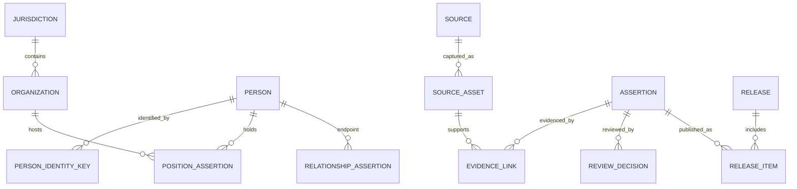

# Production Domain Model

Status: Draft for review

## 1. Model principle

Separate an entity from an assertion about that entity. `person` answers “which identity”; `assertion` answers “what a source says, for what time, with what confidence and review state.” This prevents a newer import from silently overwriting history.

## 2. Bounded contexts

### Registry

- `jurisdictions`: administrative hierarchy, codes, validity period and predecessor/successor links.
- `organizations`: canonical organization identity and temporal parent hierarchy.
- `persons`: minimal stable identity; no mutable current-role fields.
- `person_identity_keys`: typed keys (`name_birth`, official profile, external ID), verification state and uniqueness scope.
- `aliases`: names, former names and transliterations with provenance.

### Assertions

- `position_assertions`: person, organization, title, rank, valid-time range, date precision and current-status observation.
- `relationship_assertions`: typed/directed edge, endpoints, overlap organization/range, strength and evidence summary.
- `attribute_assertions`: education, birthplace, governance event, risk signal and other typed facts.
- `assertion_status`: `draft`, `reviewed`, `rejected`, `superseded`, `withdrawn`.

Each assertion has both:

- **valid time**: when the fact applied in the world;
- **system time**: when the platform learned, reviewed or superseded it.

Approximate dates retain original text plus lower/upper bounds and precision. Unknown values remain null; they are never converted to invented dates.

### Evidence and rights

- `sources`: publisher/domain identity and reliability classification.
- `source_assets`: immutable URL capture, retrieval time, HTTP metadata, content hash, storage key and parser version.
- `evidence_links`: source asset → assertion, locator, excerpt hash and support/contradict role.
- `rights_decisions`: jurisdiction, permitted uses, field/content restrictions, reviewer, legal memo reference, effective/expiry dates.
- `processing_policies`: field class, purpose, retention and exposure rule.

Reliability, factual confidence and commercial rights are independent dimensions. An official source may be reliable but not licensed for redistribution.

### Resolution and review

- `resolution_candidates`: candidate pair, model/rule version, score and feature explanation.
- `merge_decisions`: approved/rejected merge, reviewer and reversible merge plan.
- `quality_issues`: stable issue code, severity, owner, SLA and resolution.
- `review_decisions`: append-only decision events; corrections supersede prior decisions.

### Releases

- `releases`: immutable ID, corpus/schema/code versions, cutoff time, manifest hash and signature.
- `release_items`: released assertion ID plus visibility and entitlement class.
- `release_metrics`: coverage, freshness, evidence, identity and rights metrics by jurisdiction.
- `export_jobs`: tenant, release, entitlement manifest, filters, result hash and expiry.

## 3. Required invariants

1. A published assertion has at least one supporting evidence link.
2. A commercial release item has an effective rights decision permitting its use.
3. A strong relationship has explicit evidence or a verified overlap organization and time range.
4. A current role has an `observed_at`/`as_of` date.
5. A merge cannot erase source-scoped IDs or provenance.
6. Rejected and superseded assertions remain auditable but are absent from Gold views.
7. Every export is reproducible from `release_id + entitlement_manifest + filters`.
8. Customer-facing records never expose raw restricted content or internal reviewer notes.

## 4. Mapping from SQLite v2

| SQLite v2 | Production target |
| --- | --- |
| `raw_records`, `profile_documents` | object asset + ingest record |
| `persons`, `person_aliases` | registry person + identity key + alias |
| `organizations`, `jurisdictions` | temporal organization/jurisdiction registry |
| `positions`, `relationships`, `claims` | typed assertions |
| `sources`, `evidence_links` | source + source asset + evidence link |
| `entity_provenance` | ingest lineage |
| `resolution_candidates` | resolution review queue |
| `quality_issues` | governed issue workflow |
| Gold views | immutable release projections |

SQLite IDs remain external lineage keys during migration; production IDs are UUIDs and are never recycled.

