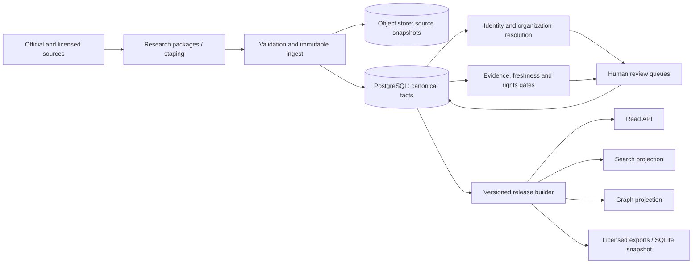

# Commercial Government Relationship Platform — System Design

Status: Draft for review

Date: 2026-08-10

## 1. Product boundary

The product answers evidence-backed questions about public government careers:

- who held a role at a given date;
- a person's sourced career timeline;
- verified predecessor/successor and overlapping-tenure relationships;
- leadership-team snapshots and cross-region cadre movement;
- what changed between two data releases and why.

Primary users are policy/research analysts, compliance and due-diligence teams, data/API customers, internal data curators, and source-rights reviewers. The product does **not** publish private contact details, family data without a specific lawful basis, speculative patronage claims, psychological profiles, or unverified allegations. Public availability alone is not treated as commercial permission.

## 2. Runtime architecture

### Services

| Component | Responsibility | Mutation authority |
| --- | --- | --- |
| Intake | Accept staged research packages and source snapshots | Bronze only |
| Normalizer | Convert legacy/profile records into canonical assertions | Silver draft |
| Resolver | Produce person/org merge candidates | No automatic ambiguous merge |
| Review | Approve/reject facts, merges, rights and takedowns | Curator roles only |
| Release builder | Freeze an immutable, reproducible data version | Gold only after gates |
| Query API | Search and traverse released data | Read-only |
| Export worker | Produce tenant-entitled, rights-cleared extracts | Read-only release input |

Research, publication and customer access are separate security domains. A failed ingest never changes the active release. Graph/search projections are disposable and rebuilt from a release manifest.

## 3. Storage strategy

- **PostgreSQL** is the production system of record for canonical entities, assertions, review decisions and release manifests.
- **Object storage** retains fetched documents, normalized text, checksums and capture metadata. Content is immutable; a corrected fetch creates a new asset.
- **SQLite** remains the offline/reference snapshot generated by `scripts/govdb.py`.
- **Search** starts with PostgreSQL indexes. Add a dedicated search engine only after measured query/SLA pressure.
- **Graph** queries use relational edges initially. Add a graph projection only for proven multi-hop workloads.

Partition high-volume append-only tables (`source_assets`, `assertions`, `audit_events`) by capture/release time after scale measurements; do not partition small master tables. Production tenant-facing tables use default-deny row-level policies, while corpus visibility is enforced through release entitlements.

## 4. Operating modes

1. `research`: create evidence-backed staged packages.
2. `validate`: enforce schema, source, temporal and relationship rules.
3. `ingest`: append raw records and draft assertions idempotently.
4. `review`: resolve identities, facts, rights and quality issues.
5. `release`: freeze a signed manifest after all gates pass.
6. `serve`: expose only immutable release IDs through read APIs.
7. `export`: generate tenant-scoped extracts from eligible Gold records.

Every job has an idempotency key, actor, input digest, code/schema version, start/end time and structured result. Reprocessing the same immutable input must not create duplicate facts.

## 5. Security and compliance controls

- Record processing purpose, lawful-basis review, retention class and rights decision separately from source reliability.
- Minimize fields by product purpose; sensitive fields are denied by default and require explicit policy approval.
- Preserve provenance without exposing restricted source content to customers.
- Support correction, suppression, takedown and supersession without deleting the audit trail.
- Encrypt data in transit and at rest; keep secrets and API keys outside the corpus database.
- Log every curator decision and commercial export; use short-lived signed download URLs.
- Require counsel-approved policy before any source or field class becomes commercially exportable.

These controls reflect the distinction between government information being publicly accessible and personal-information processing being automatically unrestricted. They are design controls, not a legal conclusion.

## 6. API and release SLOs

- Every response includes `release_id`, `generated_at`, `as_of`, confidence and provenance availability.
- Cursor pagination is mandatory; offset pagination is not exposed for large collections.
- Target read availability: 99.9% monthly for paid API; release builds are asynchronous.
- Target p95 latency: 300 ms for entity lookup, 800 ms for filtered network queries.
- Recovery objectives: RPO 15 minutes for review operations; RTO 4 hours. Immutable source assets and release manifests must be recoverable independently.
- Freshness is an explicit per-jurisdiction metric, not a global promise.

## 7. Commercial packaging

| Tier | Surface | Data boundary |
| --- | --- | --- |
| Explorer | Web search and sourced profiles | Current release, limited depth |
| Analyst | Advanced filters, snapshots, change feeds | Reviewed facts and relationships |
| API | Metered entity/network endpoints | Contracted fields and jurisdictions |
| Enterprise | Bulk snapshots and private review queues | Tenant-specific entitlement manifest |

No tier bypasses evidence, privacy, source-rights or quality gates.

## 8. Design decisions and open questions

Accepted decisions:

- claim/evidence records are first-class; narrative profiles are projections;
- current office is a dated observation, never a mutable person attribute;
- false separation is preferable to a false person merge;
- releases are immutable and queries pin to a release;
- billing, users and API keys live in an application database/schema, not research tables.

Open decisions requiring product/legal input:

- launch jurisdictions and customer segments;
- permitted field classes and retention periods;
- source licensing strategy and whether source excerpts may be redistributed;
- acceptable freshness targets per jurisdiction level;
- whether customers may see plausible facts or confirmed facts only.

## 9. External design basis

- PostgreSQL row-level security supports default-deny per-role policies: <https://www.postgresql.org/docs/17/ddl-rowsecurity.html>
- PostgreSQL declarative partitioning is reserved for measured large-table needs: <https://www.postgresql.org/docs/17/ddl-partitioning.html>
- The HTTP contract follows OpenAPI 3.1: <https://spec.openapis.org/oas/v3.1.0.html>
- Privacy/legal review must use the official Personal Information Protection Law text: <https://www.npc.gov.cn/npc/c2/c30834/202108/t20210820_313088.html>
